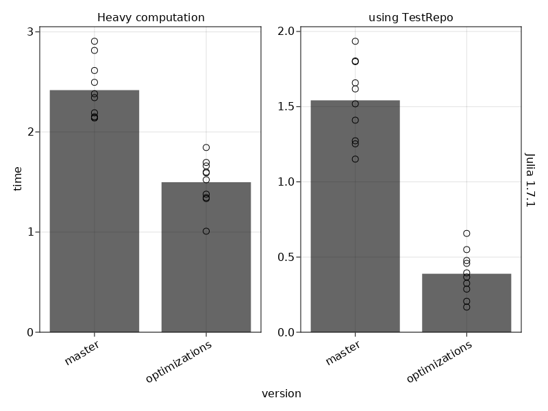
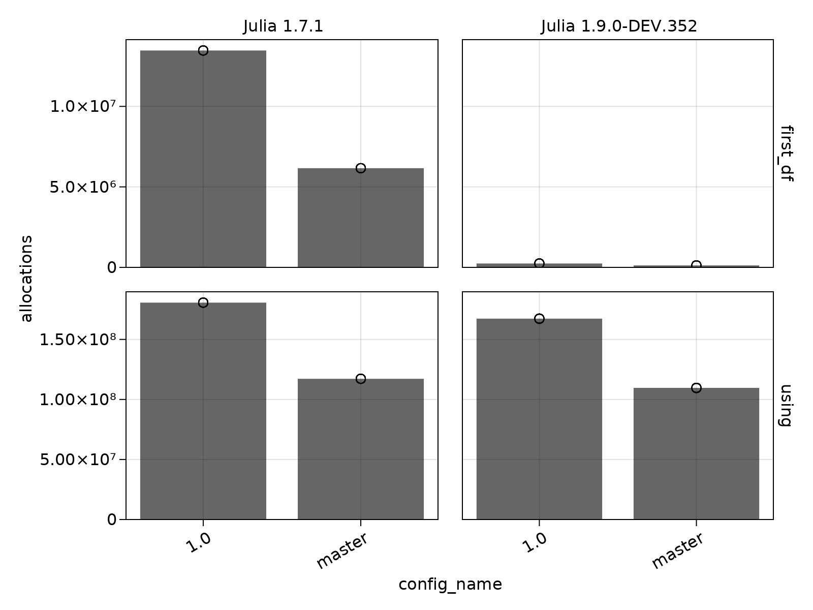

# VersionBenchmarks

A package to run benchmarks of different versions, branches, or commits of packages against each other on multiple Julia versions.

It is especially useful for measuring time to first plot (TTFP) or `using` latency of packages, because these can only be measured once per Julia session.
VersionBenchmarks.jl runs each code file multiple times with a fresh Julia process for each run.

Here is a simple example testing latest `master` against `v1.0.0` for the DataFrames package, once for the default `julia` command and once with Julia 1.9.

```julia
using VersionBenchmarks

df = benchmark(
    [
        Config("master", (name = "DataFrames", rev = "master")),
        Config("1.0", (name = "DataFrames", version = "v1.0.0")),
        Config("master", (name = "DataFrames", rev = "master"),
            `/Applications/Julia-1.9.app/Contents/Resources/julia/bin/julia`),
        Config("1.0", (name = "DataFrames", version = "v1.0.0"),
            `/Applications/Julia-1.9.app/Contents/Resources/julia/bin/julia`),
    ],
    "dataframes.jl",
    repetitions = 10,
)
```

The `Config` struct has three arguments.
1. A name that summarizes the packages being used.
2. A `NamedTuple` or a `Vector{NamedTuple}` (if multiple different packages should be tested together) that serve as input arguments for `Pkg.PackageSpec`s which should be installed. Typical keys are `name`, `url`, `path`, `rev`, `version` and `subdir`. 
3. Optionally, a command to run Julia (`julia` by default).

You can supply one code file or a vector of code files.
Each file is run for n `repetitions`, with `Config`s alternating so that the samples for one `Config` are spaced apart in time.
This guards against misinterpreting system performance fluctuations over time as significant differences between `Config`s.

## Benchmark macros

There are two macros you can use in your test code.
They measure timings and allocations and write the results out to the collecting process automatically.

The first macro is `@vbtime` which behaves similarly to `@time`, measuring runtime, garbage collection time, and allocations.
This macro is run once with each repetition and can be used to measure things like `using` latency or time to first plot.

The second macro is `@vbbenchmark` which is a wrapper for `BenchmarkTools.@benchmark`.
This macro should be used with any code that can be run multiple times per session, so everything that doesn't measure first-use compilation latencies.
Because it already runs its code multiple times to get a more accurate estimate, it's not necessary to run it on each `repetition`.
Therefore, `@vbbenchmark` runs only on repetition 1.

The example code file, `dataframes.jl`, could look like this.
The `using` statement and the first `DataFrame` construction can only be measured once per repetition, so they use `@vbtime`.
The `DataFrame` constructor can be measured with `@vbbenchmark`.

```julia
@vbtime "using" begin
    using DataFrames
end

@vbtime "first_df" begin
    DataFrame(a = 1:10)
end

@vbbenchmark "DataFrame" begin
    DataFrame()
end
```

You can call these functions on the resulting DataFrame:

```julia
VersionBenchmarks.summarize_repetitions(df)
VersionBenchmarks.plot_summary(df [, :time_s]) # can change second arg to :allocations or :gctime
```

For example:

```julia
VersionBenchmarks.plot_summary(df)
```




```julia
VersionBenchmarks.plot_summary(df, :allocations)
```



