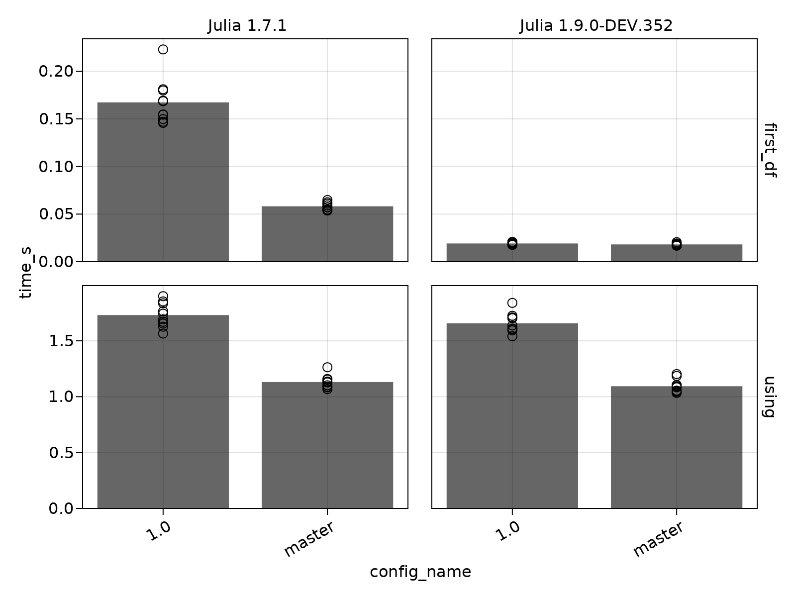

# VersionBenchmarks

A package to run benchmarks of different versions, branches, or commits of a repository against each other.

```julia
using VersionBenchmarks

df = VersionBenchmarks.benchmark(
    [
        Config("master"),
        Config("optimizations"),
    ],
    path = path_to_repo,
    testfile,
    repetitions = 10,
)
```

Each test file is run once per repetition, with code versions and julia versions alternating so that the samples for one code version and julia version are spaced apart in time.

The example test file looks like this:

```julia
@vbtime "using TestRepo" begin
    using TestRepo
end

@vbtime "Heavy computation" begin
    TestRepo.heavy_computation()
end
```

The `@vbtime` macros save timing, allocation and gctime info in a file.
They are run in every repetition.
The results are then passed back in a `DataFrame`.

You can also use `@vbbenchmark`, which is a wrapper for `BenchmarkTools.@benchmark`.
It only runs on the first repetition, because it includes its own repetitions already.

You can call these functions on the resulting DataFrame:

```julia
VersionBenchmarks.summarize_repetitions(df)
VersionBenchmarks.plot_summary(df [, :time]) # can change second arg to :allocations or :gctime
```

For example:

```julia
VersionBenchmarks.plot_summary(df)
```



